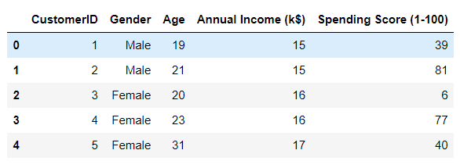
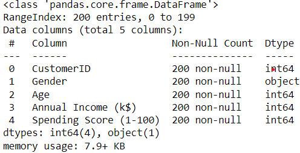
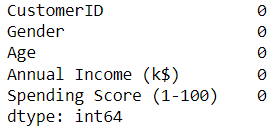
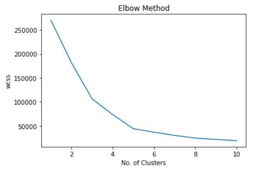
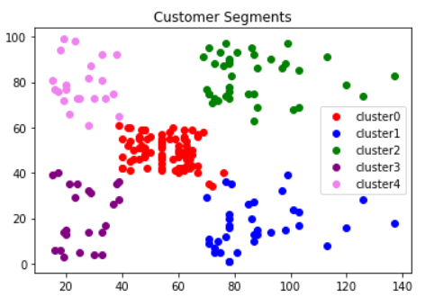

# Implementation-of-K-Means-Clustering-for-Customer-Segmentation

## AIM:
To write a program to implement the K Means Clustering for Customer Segmentation.

## Equipments Required:
1. Hardware – PCs
2. Anaconda – Python 3.7 Installation / Moodle-Code Runner

## Algorithm
1. Import the necessary packages.
2. Read the given csv file and display the few contents of the data.
3. Import KMeans and use for loop to calculate the within cluster sum of squares the data.
4. Plot the wcss for each iteration, also known as the elbow method plot.
5. Predict the clusters and plot them.

## Program:
```py 
/*
Program to implement the K Means Clustering for Customer Segmentation.
Developed by: Naveenkumar.S
RegisterNumber:  212221240033

#import packages
import pandas as pd
import matplotlib.pyplot as plt
df=pd.read_csv("Mall_Customers.csv")
df.head()

#checking the data information and null presence
df.info()
df.isnull().sum()

#calculating within cluster sum of squares for each culster and passing it to an array
from sklearn.cluster import KMeans
wcss = []  
for i in range(1,11):
    kmeans = KMeans(n_clusters = i,init = "k-means++")
    kmeans.fit(df.iloc[:,3:])
    wcss.append(kmeans.inertia_)

# visualizing the trend in wcss-elbow method
plt.plot(range(1,11),wcss)
plt.xlabel("No. of Clusters")
plt.ylabel("wcss")
plt.title("Elbow Method")
plt.show()

#predicting clusters
km = KMeans(n_clusters = 5)
km.fit(df.iloc[:,3:])
y_pred = km.predict(df.iloc[:,3:])
df["cluster"] = y_pred
df0 = df[df["cluster"]==0]
df1 = df[df["cluster"]==1]
df2 = df[df["cluster"]==2]
df3 = df[df["cluster"]==3]
df4 = df[df["cluster"]==4]

#visualising the clusters
plt.scatter(df0["Annual Income (k$)"],df0["Spending Score (1-100)"],c="yellow",label="cluster0")
plt.scatter(df1["Annual Income (k$)"],df1["Spending Score (1-100)"],c="pink",label="cluster1")
plt.scatter(df2["Annual Income (k$)"],df2["Spending Score (1-100)"],c="cyan",label="cluster2")
plt.scatter(df3["Annual Income (k$)"],df3["Spending Score (1-100)"],c="skyblue",label="cluster3")
plt.scatter(df4["Annual Income (k$)"],df4["Spending Score (1-100)"],c="violet",label="cluster4")
plt.legend()
plt.title("Customer Segments")
plt.show()
*/
```

## Output:
### Dataset:

### Dataset information:

### IsNull:

### Elbow method graph (wcss vs each iteration):

### Cluster represnting customer segments-graph:


## Result:
Thus the program to implement the K Means Clustering for Customer Segmentation is written and verified using python programming.
